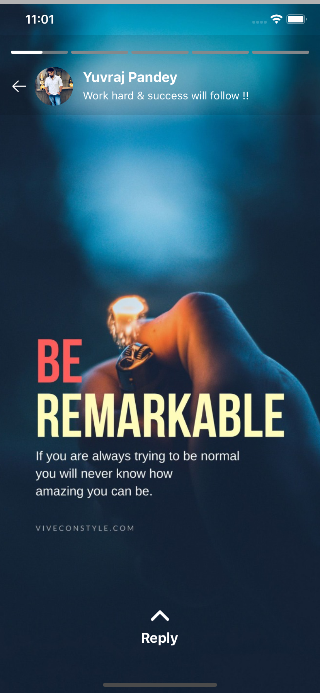
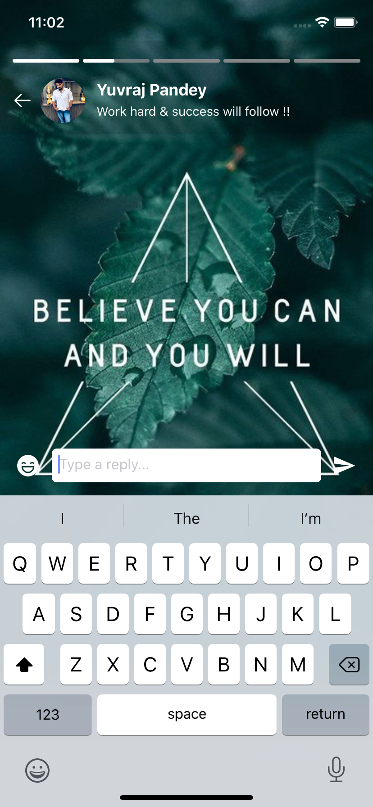
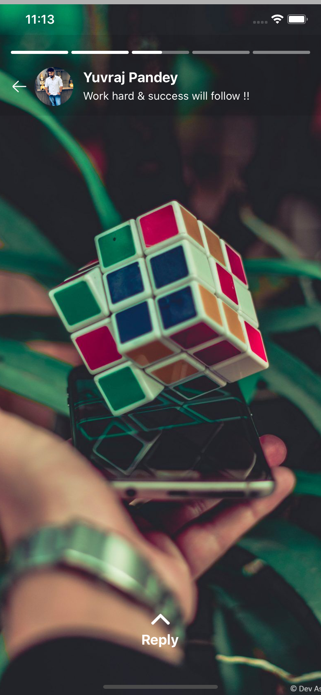
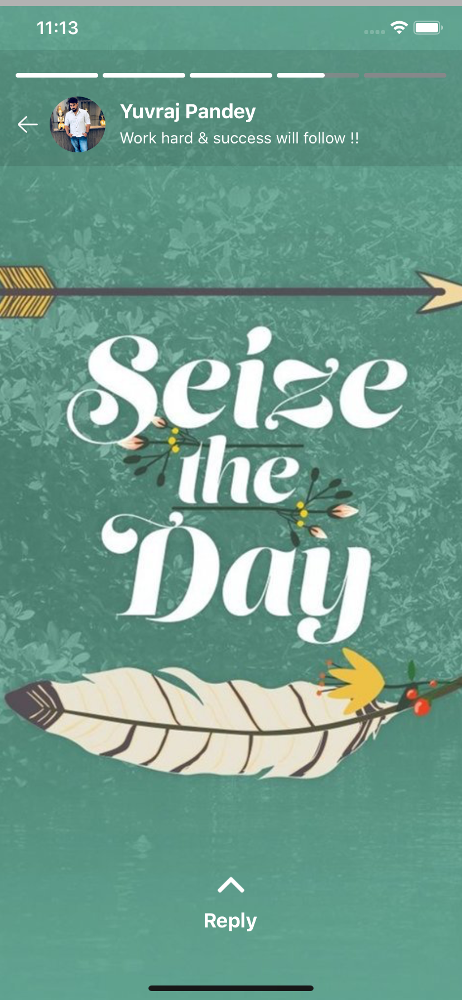

# React Native Insta Stories 

A simple and fully customizable React Native components that provides a status/stories feature like Whatsapp, Instagram. For navigation across all the stories you can touch the left or right portion of the screen similar to what we see on Whatsapp or Instagram. The library works seemleslly across both Android as well as IOS platform developed with ❤️ in <b>Typescript & React</b> 🔥.

#### Feature's include :

* Progress bar with custom duration & styling options.
* Story Image view with custom styling options.
* A fully customizable Header View, you can use default one or pass in your choice of component.
* A fully customizable Footer View, you can use default one or pass in your choice of component.
<br> 

## Screenshots

|Example One                |  Example Two              | Example Three               |  Example Four       | Example Five   |
|-------------------------|-------------------------|-------------------------|-------------------------|-------------------|
| |  |  |  | |
<br>

## Installation

If using yarn:

```
yarn add wyndrick/react-native-insta-stories
```

If using npm:

```
npm i wyndrick/react-native-insta-stories
```
<br>

* ### ProgressBar

This individual component can be used to display progressive bar with controlled duration, style & motion. To programatically enable or disable the progress pass boolean value to `enableProgress` & to change the position of progress use `progressIndex` prop along with `duration` prop to control the motion. On every change of propress position `onChange` function will be invoked for any customization.

```js
<ProgressBar
   images={['','']}
   onChange={() => {}}
   progressIndex={0}
   enableProgress={true}
   duration={20}
   barStyle={{
      barActiveColor: BAR_ACTIVE_COLOR,
      barInActiveColor: BAR_INACTIVE_COLOR,
      barWidth: 100, 
      barHeight: 4
   }}
/>
```

* ### StoryContainer

This component provides you with entire functionality of Status/Stories feature along with flexible customization.

#### Basic Usage

This simply display's only the Progress Bar & the Story view images without any header or footer view. The container can be given style by providing `containerStyle` props.

```js
import { StoryContainer } from 'react-native-stories-view';

<StoryContainer
   visible={true}
   enableProgress={true}
   images={images}
   duration={20}  
   containerStyle={{
       width: '100%',
       height: '100%',
   }}
/>
```

#### Header View

You can use the inbuilt header view which can display basic user details by simply providing `userProfile` props with specified parameters.

```js
// User Information in header
<StoryContainer
   visible={true}
   enableProgress={true}
   images={images}
   duration={20} 
   userProfile={{
      userImage: PROFILE,
      userName: 'Wyndrick',
      userMessage: 'Some message !!',
      imageArrow: BACK,
      onImageClick: () => {
         Alert.alert('User profile image tapped');
      },
   }}
/>
```

However if you wish to add your own custom component, you can pass your own component in `headerComponent` prop and this will replace the header described above.

```js
<StoryContainer
   visible={true}
   enableProgress={true}
   images={images}
   duration={20} 
   headerComponent={<View />}
/>
```

In case neither of the prop i.e `userProfile` or `headerComponent` is passed then header view will be not be displayed.

#### Footer View

The in built footer view provides you with a reply option where in you can accept user input for the status user just viewed.
`isShowReply` boolean prop can be used to programaically show or hide the footer reply view. The `onReplyTextChange` & `onReplyButtonClick` function provides callback for the action performed by the user along with the `progressIndex` of the particular story currently viewed.

```js
// Reply option in Footer
<StoryContainer
   visible={true}
   enableProgress={true}
   images={images}
   duration={20} 
   replyView={{
      isShowReply: true,
      onReplyTextChange: (textReply, progressIndex) => {
          console.log(`Text : ${textReply} , position : ${progressIndex}`);
      },
      onReplyButtonClick: (buttonType, progressIndex) => {
         switch (buttonType) {
            case 'send':
               console.log(`Send button tapped for position : ${progressIndex}`);
               break;

             case 'smiley':
               console.log(`Smiley button tapped for position : ${progressIndex}`);
               break;
          }
       },
   }}
/>
```

If you have your own custom component to use in Footer, simply pass your component in `footerComponent` prop as below which will replace the inbuilt Footer with your own custom style. 

```js
// Custom Footer component option
<StoryContainer
   visible={true}
   enableProgress={true}
   images={images}
   duration={20}     
   footerComponent={<View />}
/>
```

However if neither of the prop i.e `replyView` or `footerComponent` is passed then footer view will be not be displayed.
<br> 

## Documentation :

### ProgressBar

| **PropName**           | **PropType**     | **Purpose**                                      |  **Required**  |
| :--------------------- | :--------------: | :---------------------------------------------   | :------------: |
| images                 |  `Array<String>` | Story images array to render count of bar        |  Mandatory     |
| progressIndex          |    `number`      | Starts progress for a particular index item      |  Mandatory     |
| enableProgress         |    `Boolean`     | Start/Stop the progress bar motion               |  Optional      | 
| duration               |    `Number`      | Control's the speed of progress bar              |  Optional      |
| barStyle               |    `Object`      | Progress Bar style                               |   Optional     | 
| barActiveColor         |    `String`      | Active progress color                            |   Optional     | 
| barInActiveColor       |    `String`      | In Active progress color                         |   Optional     | 
| barWidth               |    `number`      | Default 100, Always > 10 but < 100               |   Optional     | 
| barHeight              |    `number`      | Default 7, Always > 4 but < 10                   |   Optional     | 
| onChange               |    `Function`    | Function executes after change in progressIndex  |    Optional    | 

### Basic

| **PropName**           | **PropType**     | **Purpose**                                      |  **Required**  |
| :--------------------- | :--------------: | :---------------------------------------------   | :------------: |
| visible                |    `Boolean`     | Toggle visibility of Story Container             |  Mandatory     |
| enableProgress         |    `Boolean`     | Enable/disable the top progress bar visibility   |  Optional      |
| images                 |  `Array<String>` | Story Images                                     |  Mandatory     |
| duration               |    `Number`      | Control's the speed of progress bar              |  Optional      |
| containerStyle         |    `Object`      | Container style                                  |   Optional     | 

### Header

| **PropName**           | **PropType**     | **Purpose**                                      |  **Required**  |
| :--------------------- | :--------------: | :---------------------------------------------   | :------------: |
| userProfile            |    `Object`      | Default user detail view                         |    Optional    |
| userImage              |    `String`      | Image URL                                        |    Optional    |
| userName               |    `String`      | Display's user name                              |    Optional    |
| userMessage            |    `String`      | Display's user information                       |    Optional    |
| imageArrow             |    `String`      | Image Url                                        |    Optional    | 
| onImageClick           |    `Function`    | Function that executes imageArrow click event    |    Optional    | 
| headerComponent        |    `Component`   | Custom component                                 |    Optional    | 

### Footer

| **PropName**           | **PropType**     | **Purpose**                                      |  **Required**  |
| :--------------------- | :--------------: | :---------------------------------------------   | :------------: |
| replyView              |    `Object`      | Default reply view with Input text               |    Optional    |
| isShowReply            |    `Object`      | Toggle's the display of footer view              |    Mandatory   |
| onReplyTextChange      |    `String`      | Callback for user entered text with posotion     |    Optional    |
| onReplyButtonClick     |    `String`      | Callback for emoji & send click with posotion    |    Optional    | 
| footerComponent        |    `Component`   | Custom component                                 |    Optional    | 
<br> 

